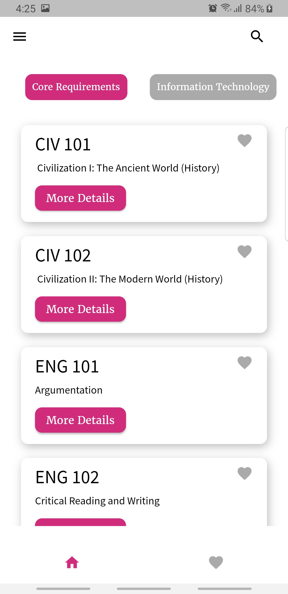

# AUIS_classroom

this is my capstone project

this application talks to an API written in PHP to connect to a database.

both the PHP file and database are still on my local machine. if you want to see this application work please don't hesitate to contact me and we will set a meeting to demonstrate the application.

here are some screenshots

